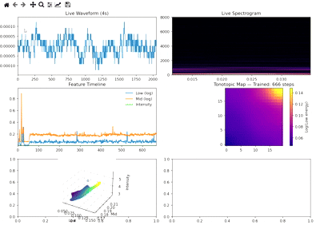

# 🎧 Real-Time Auditory Cortex Simulation using Self-Organizing Maps

**Version:** 1.0.0
**Author:** Abolfazl Mastaalizadeh
**License:** MIT
**Repository:** [https://github.com/yourusername/auditory-som-live](https://github.com/yourusername/auditory-som-live)

---

## 🧠 Introduction

This project provides a live simulation of the **tonotopic organization of the auditory cortex**. The system captures environmental sound via a **microphone**, extracts features in real-time, and performs online training of a **Self-Organizing Map (SOM)** to visualize the dynamic evolution of neurons over time.

This tool is designed for:

* Computational neuroscience research
* Tonotopic map simulations
* Teaching concepts of signal visualization and unsupervised learning
* Real-time demonstrations

---

## 🔬 Project Concept

The auditory cortex in mammals organizes frequencies along a tonotopic axis. This project replicates this principle by:

1. Capturing live environmental audio
2. Performing real-time frequency and energy analysis
3. Extracting low-level features (Low, Mid, Intensity)
4. Online learning with a SOM
5. Visualizing the evolving tonotopic map live

---

## 🧩 Key Features

### 🎙️ Live Microphone Stream

* Continuous audio capture with **PyAudio**
* Error handling and automatic recovery
* Circular audio buffer to reduce latency

### 🔍 Feature Extraction

From each audio chunk, the following features are computed:

* **Low energy (log)**
* **Mid energy (log)**
* **Intensity (mean amplitude)**

These features are used to train the SOM neurons.

### 🧠 2D SOM for Tonotopy

* Size: 20×20
* Neighborhood function: Gaussian
* Online learning (1 step per audio chunk)
* Low energy mapped along the tonotopic axis

### 📊 Real-Time Visualization

The program provides live panels for:

* Waveform
* Spectrogram
* Feature timelines
* SOM tonotopic map
* 3D neuron feature scatter plot

### 💾 Saving Outputs and Final Analysis

* Final SOM weights saved
* Final tonotopic map saved as PNG
* Feature trajectories over time saved
* NPY files generated for further analysis

---

## 🖼️ Screenshot of the Program

Below is an example of the program running, showing live waveform, spectrogram, features, and the evolving SOM tonotopic map:


> Note: Replace `screenshot_example.png` with an actual screenshot saved from the `auditory_som_results` folder after running the program.

---

## 🛠️ Installation & Setup

### 1. Install dependencies

```bash
pip install numpy matplotlib minisom scipy pyaudio
```

> Note: Installing PyAudio may require system packages (e.g., `portaudio`).

### 2. Run the program

```bash
python auditory_som_live.py
```

Once started, the program will:

* Listen to environmental audio
* Extract features
* Train the SOM online
* Display the live tonotopic map

To safely exit, press **q** in the visualization window.

---

## 📁 Output Folder (`auditory_som_results/`)

| File                      | Description                        |
| ------------------------- | ---------------------------------- |
| `final_som_weights.npy`   | Final SOM weights (20×20×3 matrix) |
| `final_tonotopic_map.png` | Trained tonotopic map              |
| Feature timeline plots    | Feature evolution over time        |

---

## 🧠 System Architecture (Flow)

```
 Microphone → Audio Buffer → Feature Extraction → Online SOM Training
                                 ↓
                         Real-Time Visualization
                                 ↓
                       Save Final Results & Maps
```

---

## 📌 Feature Extraction Details

Features are calculated based on frequency band energy:

| Band   | Frequency Range (Hz) | Model Use  |
| ------ | -------------------- | ---------- |
| Band 1 | 50–200               | Low energy |
| Band 3 | 800–3200             | Mid energy |
| —      | Signal amplitude     | Intensity  |

Logarithm is applied to stabilize numeric range.

---

## 📐 SOM Structure

* Size: `20 × 20 × 3`
* Input per neuron: `[low, mid, intensity]`
* Neighborhood function: Gaussian
* Initial σ: `3.0`
* Learning rate: `0.5`
* Online learning: 1 step per input

---

## 🎬 Live Visualization

Panels include:

* Last 4 seconds waveform
* Continuous spectrogram
* Feature timeline plots
* Low energy tonotopic map
* 3D neuron feature scatter plot

Updates in real-time during audio capture.

---

## 📥 Stopping and Saving

Press **q** to:

* Stop all threads
* Save final SOM weights
* Save final tonotopic map
* Save PNG outputs

---

## 📚 References & Inspiration

* Tonotopy in mammalian auditory cortex
* Interpretable Self-Organizing Map models for brain simulations
* MiniSom library for simple SOM implementation

---

## 📝 License

This project is released under the **MIT License**.

---

## 🔁 Future Suggestions

* Support audio files in addition to live microphone
* Allow SOM parameters to be adjustable via CLI or GUI
* Periodic saving of training state for recovery

## Live Demo
